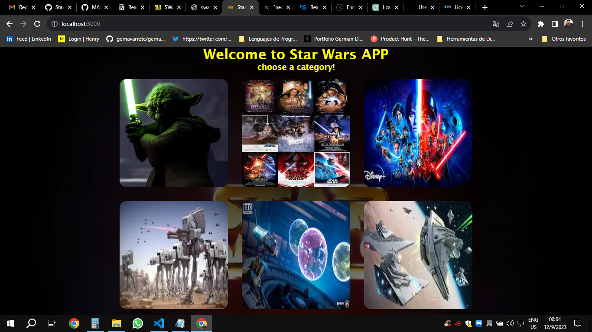
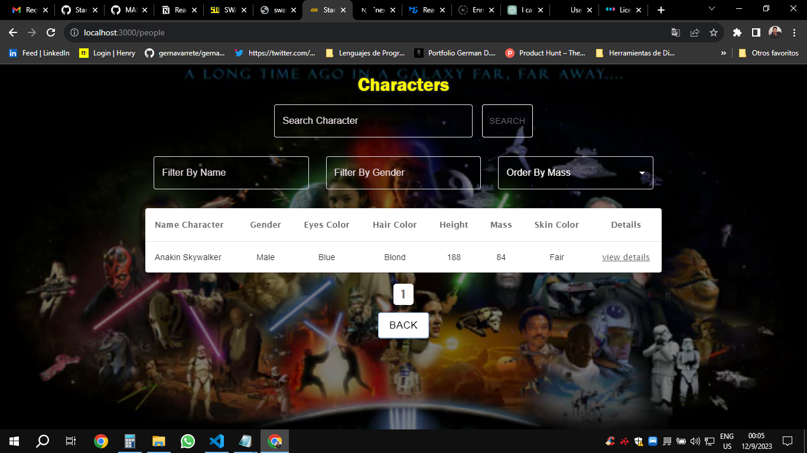

# Star Wars Explorer

## Descripción

**Star Wars Explorer** es una Single Page Application (SPA) que te permite explorar el emocionante mundo de la saga Star Wars. Con esta aplicación, podrás consultar toda la información relacionada con tus personajes, naves, planetas y más, a través de una búsqueda por nombre fácil y rápida.

## Características Destacadas

- **Búsqueda por Nombre:** Encuentra rápidamente información detallada sobre tus personajes, naves, planetas y otros elementos de Star Wars simplemente ingresando su nombre en el campo de búsqueda.
- **Detalles Completos:** Obtén datos completos y detallados sobre cada elemento de Star Wars, incluyendo su historia, apariciones en películas, características técnicas y mucho más.
- **Interfaz Intuitiva:** La interfaz de usuario intuitiva y amigable facilita la navegación y búsqueda de información.
- **Actualizaciones en Tiempo Real:** La aplicación se actualiza automáticamente con la información más reciente de la saga Star Wars, gracias a la API de Star Wars (https://swapi.dev/).

## Capturas de Pantalla

## Instalación

1. Clona este repositorio: `git clone https://github.com/gernavarrete/StarWarsChallenge.git`
2. Navega al directorio del proyecto: `cd star-wars-challenge`
3. Abre `src/app/page.js` en tu navegador web.

## Uso

1. En la pagina principal escoge la categoria por la cual deseas buscar.
2. Luego utiliza el campo de búsqueda para ingresar el nombre del personaje, nave, planeta u otro elemento que desees consultar.
3. Haz clic en el botón "Buscar" para ver los resultados.
4. Haz clic en un elemento de la lista de resultados para obtener información detallada.

## Tecnologías Utilizadas

- HTML5
- CSS3
- JavaScript
- React con Nextjs
- API --> https://swapi.dev/

## Contribución

Si deseas contribuir a este proyecto, sigue los siguientes pasos:

1. Fork del repositorio.
2. Crea una rama (`git checkout -b feature/nueva-funcionalidad`).
3. Haz tus cambios y realiza un commit (`git commit -m 'Añade nueva funcionalidad'`).
4. Push a la rama (`git push origin feature/nueva-funcionalidad`).
5. Abre un Pull Request.

## Créditos

- Desarrollador: German Dario Navarrete
- API de Star Wars: SWAPI The Star Wars API

## Licencia

Este proyecto está bajo la licencia GNU General Public License v3.0
. Consulta el archivo [LICENSE.md](LICENSE.md) para obtener más detalles.

---
